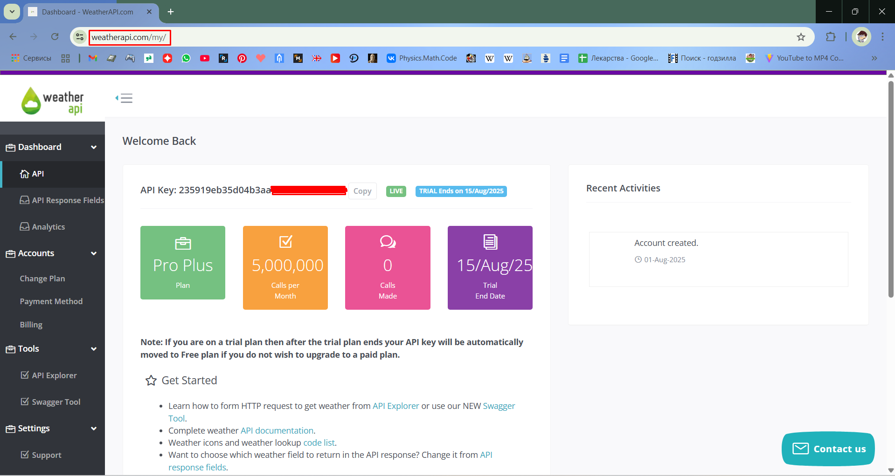
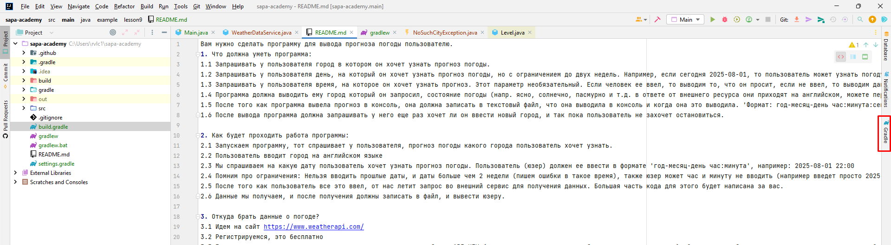
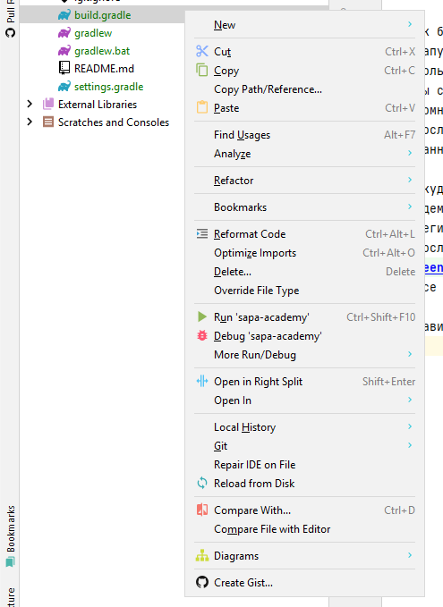
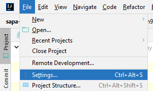
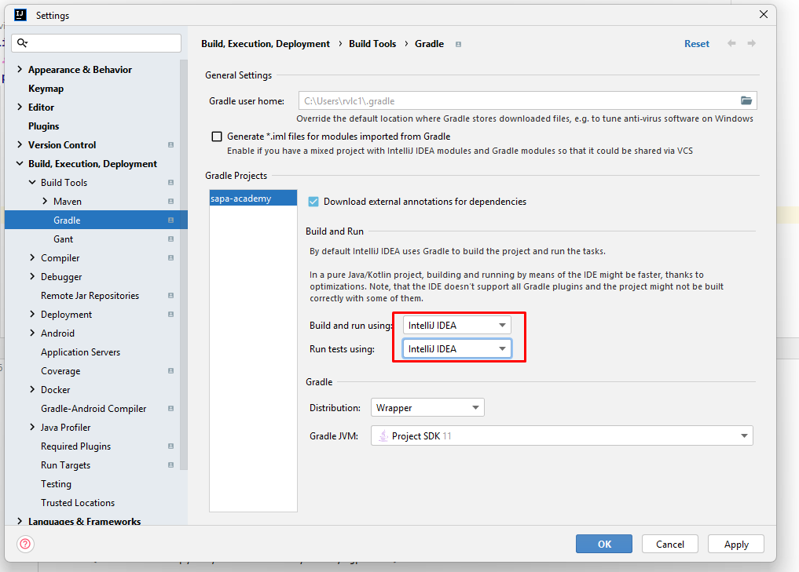

# ☁️ Домашнее задание: Прогноз погоды

Вам нужно сделать программу для **вывода прогноза погоды пользователю**.

---

## 1. Что должна уметь программа

1.1 Запрашивать у пользователя город, в котором он хочет узнать прогноз погоды.

1.2 Запрашивать у пользователя день, на который он хочет узнать прогноз погоды, но с ограничением до двух недель. Например, если сегодня 2025-08-01, то пользователь может узнать погоду только до 2025-08-14.

1.3 Запрашивать у пользователя время, на которое он хочет узнать прогноз. Этот параметр необязательный.

1.4 Программа должна выводить:

* город, который он запросил погоду,
* дата и время на которую он запросил погоду,
* состояние погоды (например, ясно, солнечно, пасмурно и т.д. — в ответе от внешнего ресурса они приходят на английском, можете перевод положить в HashMap, и просто доставать, когда будете собирать ответ юзеру),
* температуру в Цельсиях,
* скорость ветра в км/ч.

1.5 После того как программа вывела прогноз в консоль, она должна записать в текстовый файл, что она выводила в консоль и когда она это делала.
Формат: `год-месяц-день час:минута:секунда`, когда произошел запрос от пользователя, и данные из пункта 1.4 в том порядке, в котором они были выведены пользователю.

1.6 После вывода программа должна запрашивать у него ещё раз, хочет ли он ввести новый город, и так пока пользователь не захочет остановиться.

---

## 2. Как будет проходить работа программы

2.1 Запускаем программу — она спрашивает у пользователя, прогноз погоды какого города он хочет узнать.

2.2 Пользователь вводит город на английском языке.

2.3 Программа спрашивает, на какую дату пользователь хочет узнать прогноз погоды. Пользователь должен ввести её в формате `'год-месяц-день час:минута'`, например: `2025-08-01 22:00`

2.4 Помним про ограничения:

* ❌ нельзя вводить прошлые даты,
* ❌ нельзя вводить даты больше чем 2 недели вперёд,
* ⏱ пользователь может не вводить часы и минуты (например, просто `2025-08-01`) — в этом случае:
  * если запрашиваемая дата текущий день - то выдаем данные на данный момент (лежат внутри класса Current).
  * если запрашиваемая дата будущий лень - то выдаем данные на полдень
* ⚠️ когда юзер ввел время, то нам надо искать соответствующее время в списке forecastday в объекте Forecast. Данные в ответе от внешнего сервиса приходят на каждый час, и если пользователь ввел время 22:35 то мы должны брать данные на 23:00 из списка, а если юзер ввел 22:20, то данные на 22:00 и т.д., то есть, округление времени до ближайшего часа.

2.5 После того как пользователь всё это ввёл — от нас летит запрос во внешний сервис для получения данных.
➡️ Этот код уже будет написан за вас.

2.6 Данные мы получаем, и после получения:

* ✅ выводим пользователю в консоль,
* ✅ записываем в файл то что вывели в консоль и время когда пользователь запросил эти данные

2.7 Для работы с датой можете посмотреть туториалы на ютубе по работе с LocalDate и LocalDateTime, и почитать в инете.

---

## 3. Откуда брать данные о погоде?

3.1 Идём на сайт: [https://www.weatherapi.com/](https://www.weatherapi.com/)

3.2 Регистрируемся (это бесплатно).

3.3 После регистрации и подтверждения аккаунта переходим в раздел API, где будет ваш **API KEY**.
➡️ Это ваш способ авторизации при отправке запросов (считайте логин и пароль). Я свой частично замазал, будете 
пользоваться своим

3.4 Все необходимые классы будут в папке `lesson9/hw`, там же будут и комменты на уровне кода с подсказками, что вам надо делать.

---

## ⚙️ Gradle и настройка проекта

Я добавил в проект Gradle, поэтому нужно будет кое-что сделать, чтобы всё работало:

1. Если после pull-a `master`, через пару минут у вас **не появилась вкладка Gradle** справа:

— **то** нажимаем на `build.gradle` правой кнопкой мыши и выбираем:

👉 `Link Gradle Project`

(у меня его нет, потому что я это уже сделал)

Ждём пару минут, пока Gradle подтянет всё необходимое.

2. Обязательно заходим в настройки:

И выставляем их вот так:

---

✅ Всё! Готово, можно работать!

❓ При непонятных ошибках, незапусках и другим вопросам — **обращайтесь ко мне :)**
